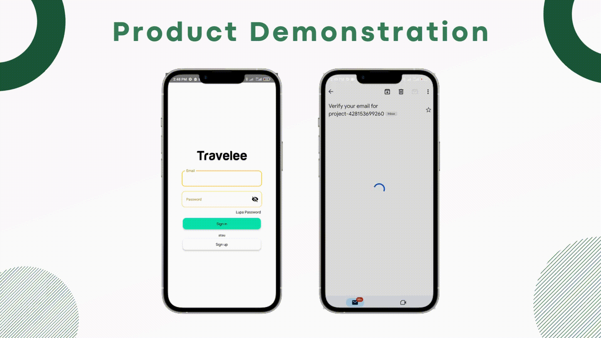
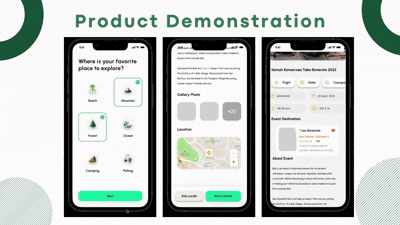
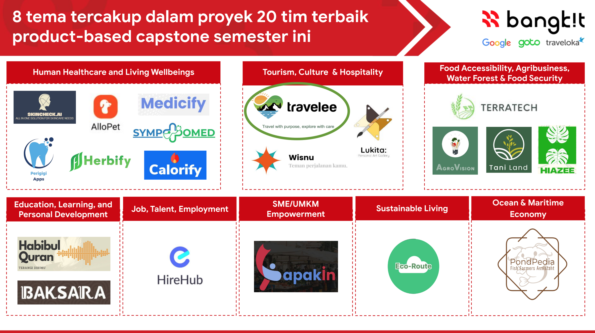
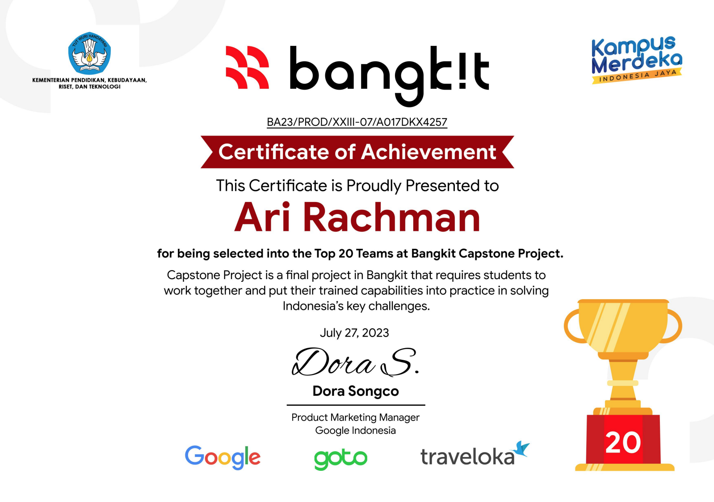

# Travelee

**Travelee** is a modern Android application designed to help users discover, explore, and support sustainable tourism destinations (eco-places) in Indonesia. Built using Jetpack Compose, it provides an interactive, visually appealing experience for travelers who care about the environment and local communities.

## Features

- **Eco-place Discovery:** Browse curated lists of eco-friendly travel destinations, complete with images, ratings, and location details.
- **Favorites:** Mark destinations as favorites for quick access and personalized planning.
- **Guidelines & Tips:** Learn local customs, sustainability practices, and travel guidelines to respect and support local culture and nature.
- **Search & Filter:** Easily search for destinations and filter based on preferences such as activities, location, and rating.
- **User Authentication:** Register and log in to save preferences and favorites securely.
- **Interactive UI Components:** 
  - Expandable cards for destination details
  - Chip-based preference selection
  - Custom search bars and progress indicators for a smooth user experience

## Screenshots

*(To be added)*

## Getting Started

### Prerequisites

- Android Studio (Arctic Fox or newer)
- JDK 11+
- Internet connection (for image loading and authentication)

### Installation

1. Clone the repository:
   ```bash
   git clone https://github.com/arirachman/Travelee.git
   ```
2. Open in Android Studio.
3. Build and run on an emulator or physical device.

### Usage

- Register or sign in to start exploring eco-friendly destinations.
- Use the search bar to look for specific places or activities.
- Tap on a destination card to view details and add to favorites.
- Refer to the guidelines section for tips on responsible tourism.




## Project Structure

- `app/src/main/java/com/travelee/signing/components/`: Reusable UI components (cards, buttons, chips, etc.)
- `app/src/main/java/com/travelee/signing/screen/`: Main screens (register, sign-in, destination detail)
- `app/src/main/java/com/travelee/signing/data/`: Dummy content and guidelines for responsible tourism
- `app/src/main/java/com/travelee/signing/viewmodel/`: ViewModel classes for MVVM architecture

## Tech Stack

- **Kotlin**
- **Jetpack Compose** (UI)
- **Android Navigation Component**
- **Dagger Hilt** (Dependency Injection)
- **Material3** (Design System)

## Contribution

Contributions are welcome! Please fork the repository, create a pull request, and describe your changes.

## Acknowledgement

This repository is a Capstone Project as part of one the graduation criteria from Bangkit Academy led by Google and Goto. And thereby, My team has successfully qualified as one of the 20 best capstone projects accross the hundreds other, and thereby we got the incubation offer from the later program.



## Author

- [arirachman](https://github.com/arirachman)

---

*Travelee is built to promote sustainable travel and support local communities. Happy exploring!*
